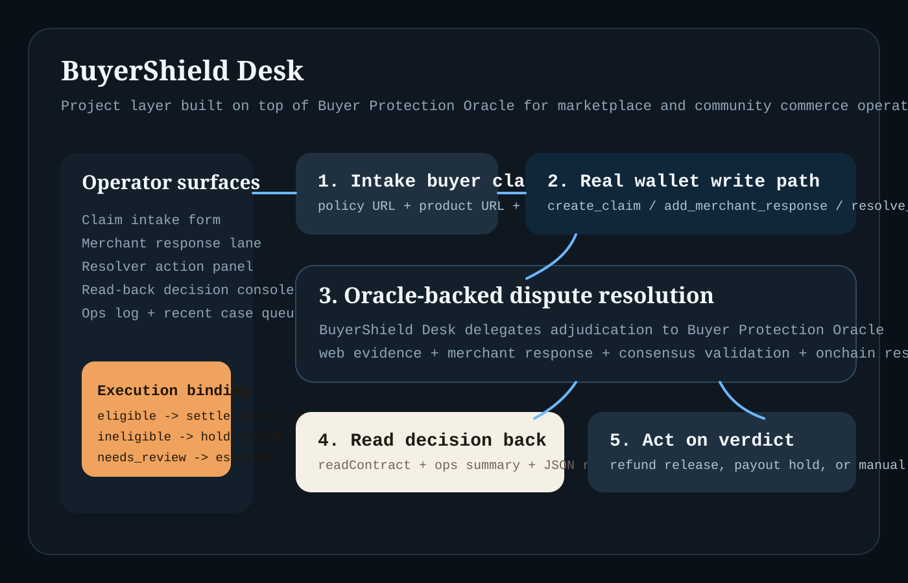

# BuyerShield Desk

BuyerShield Desk is a project layer built on top of
`buyer-protection-oracle`. It turns the contract into a practical operations
tool for community marketplaces, support teams, and escrow operators who need a
shared answer before refunding a buyer, releasing funds, or escalating a case.

## What problem this solves

Small marketplaces and community commerce systems often have the same weakness:
buyer disputes are handled in chat threads, spreadsheets, or one-off human
judgment. That makes policy enforcement inconsistent and hard to audit.

BuyerShield Desk gives the operator a single workflow:

- intake a claim from public policy, product, and evidence URLs
- attach the merchant response if the dispute is contested
- resolve the case through `BuyerProtectionOracle` on GenLayer
- read the final verdict back into an operational action panel

The result is useful for:

- community marketplaces
- peer-to-peer escrow flows
- merchant support desks
- buyer protection programs
- creator or goods marketplaces handling returns and refund conflicts

## Why this belongs in Projects

This repo is not only a contract wrapper.

It is a real app with a frontend workflow that writes to and reads from a live
GenLayer contract. GenLayer is central to the main decision path because the
project depends on a consensus-backed verdict before the operator takes action.

## How the desk works

1. the operator connects a Studionet wallet session
2. the operator creates a claim with policy, product, and evidence URLs
3. the merchant can add a public response URL
4. the app resolves the claim through `BuyerProtectionOracle`
5. the app reads the final claim state onchain
6. the operations panel turns the verdict into a practical action:
   settle buyer side, hold payout, or escalate review

## Product map



## Live contract dependency

BuyerShield Desk uses the live deployed `BuyerProtectionOracle` contract:

- Contract address: `0x85D95D6af69Aced80Fee84F5aB5e25aD4e6128ED`
- Explorer contract:
  `https://explorer-studio.genlayer.com/contracts/0x85D95D6af69Aced80Fee84F5aB5e25aD4e6128ED`
- Explorer transaction:
  `https://explorer-studio.genlayer.com/tx/0x018150f0c5fd760c627a5998054024df784663388daabcf950466e821f8a2473`

## App surfaces

The desk exposes four operator surfaces:

- desk session for wallet account and contract binding
- claim intake form
- merchant response and resolver actions
- read-back decision console with an operational gate panel

## Project structure

```text
buyershield-desk/
|-- contracts/
|   `-- buyer_protection_oracle.py
|-- docs/
|   `-- images/
|       `-- desk-architecture.svg
|-- scripts/
|   `-- serve.mjs
|-- app/
|   |-- index.html
|   |-- project-runtime.js
|   `-- lib/
|       `-- oracle-client.js
|-- site/
|   |-- app.js
|   |-- index.html
|   |-- styles.css
|   |-- data/
|   |   `-- presets.js
|   `-- lib/
|       `-- oracle-client.js
|-- submission-pack/
|   |-- JUDGE-NOTES.md
|   `-- SUBMISSION-DESCRIPTION.md
|-- tests/
|   `-- project-proof.test.mjs
|-- .gitignore
|-- LICENSE
|-- package.json
`-- README.md
```

## Local run

Start the static app locally:

```bash
npm run serve
```

Open:

```text
http://localhost:4173
```

## Technical proof

The app contains a real contract workflow in `site/lib/oracle-client.js` and a
project execution-binding surface in `app/project-runtime.js`:

- `writeContract(...)` for `create_claim`
- `writeContract(...)` for `add_merchant_response`
- `writeContract(...)` for `resolve_claim`
- `readContract(...)` for `get_claim_json`
- `waitForTransactionReceipt(...)` for accepted receipts

That means the UI is not static and does not fake GenLayer usage.

## Verification

Run:

```bash
npm test
```

The project proof checks verify:

- the contract is present in-repo
- the app writes and reads the real contract
- the decision panel binds verdicts to operational actions
- the repo includes reviewer-facing project notes

## Author

- Author: `Longc5513`
- GitHub: `https://github.com/Longc5513`

## License

MIT
